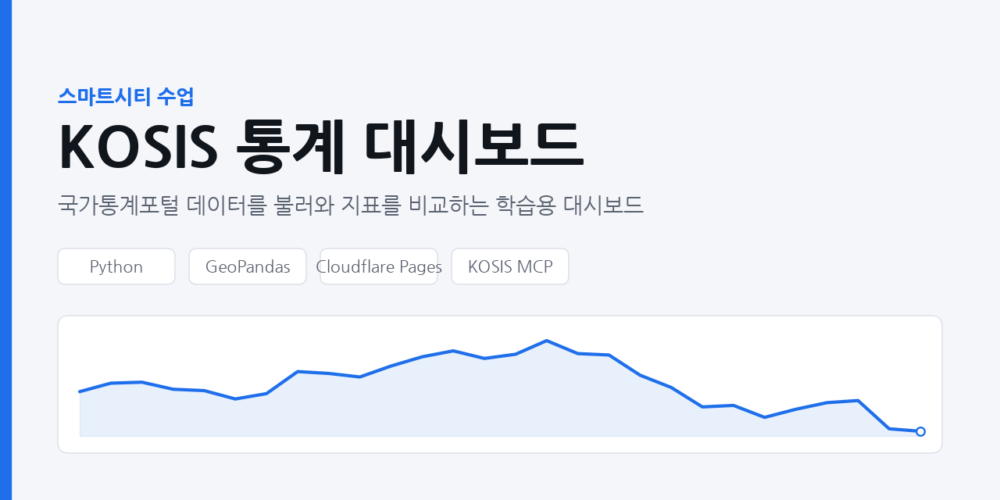

# smartcity — 관악캠퍼스 주변 수문 기반시설 통계

**배포 주소: https://smartcity-apa.pages.dev**

> KOSIS 국가통계포털 자료로 본 관악구의 강우 · 토지피복 · 하수 인프라 · 침수 피해



스마트시티 수업 과제 저장소입니다. 국가통계포털(KOSIS)에서 **관악구 단위로 실제 수록된
통계만** 모아 대시보드로 만들고, Cloudflare Pages로 배포합니다.

## 이 저장소가 다루는 범위

KOSIS는 시군구 단위 집계 통계입니다. 캠퍼스 안 개별 건물 외곽선이나 도로 선형 같은
공간 데이터는 들어 있지 않습니다. 그래서 여기서는 KOSIS가 실제로 답할 수 있는
관악구 단위 지표만 싣고, 건물·도로 형상이 필요한 부분은 별도 공간데이터로 넘깁니다.

### 수록 지표 (12개 시계열)

| 그룹 | 지표 | 통계표 | 구간 |
| --- | --- | --- | --- |
| 강우 | 연 강수량, 연 강수일수 | 강수량 및 강수일수 `DT_201004_O010005` | 2010–2024 |
| 토지피복 | 대지·도로·임야·하천 면적 | 토지현황(지목별) `DT_201004_O010002` | 2010–2024 |
| 하수 인프라 | 하수관거 시설연장, 하수도 보급률, 계획면적 | 하수관거 `DT_201004_O070015` | 2009–2023 |
| 침수 피해 | 주택 침수 세대, 이재민, 피해액 | 자연재해 발생 및 피해 현황 `DT_201004_O160036` | 2005–2022 |

강수량 통계표는 지역 분류가 없어 관악구로 분리되지 않습니다(서울 관측값). 침수 피해는
수록 연도가 불연속이라 꺾은선으로 잇지 않고 막대로 표시합니다. 불투수면 비율처럼
원표에 없는 합성 지표는 계산하지 않고 지목별 면적을 원자료 그대로 실었습니다.

### KOSIS로 채울 수 없는 부분

- **건물·도로 형상** — VWorld 건물통합정보, 도로중심선, 국가공간정보포털, 도로명주소 건물DB
- **하천 수위·유량** — 한강홍수통제소 도림천 수위 관측
- **시간 단위 강우** — 기상청 AWS 관악 지점(KOSIS는 연 단위 집계만 수록)
- **빗물받이·하수관로 위치** — 서울 열린데이터광장

관악캠퍼스는 도림천 상류 유역에 해당합니다. 위 공간데이터로 건물·도로를 그리고 이
대시보드의 관악구 통계를 배경 조건으로 붙이면 불투수면 증가와 첨두유출을 함께 볼 수 있습니다.

## 구성

```
public/
├── index.html        구조 및 레이아웃
├── styles.css        테마 및 스타일 (라이트/다크 자동 전환)
├── app.js            동작 로직 — 데이터 로드, SVG 차트, 표 렌더링
├── og-image.png      대표 이미지
└── data/
    └── dashboard.json  지표 시계열 (KOSIS MCP로 수집)
```

## 개발 환경

- Python 가상환경: `.venv` (Python 3.12.13) — `source .venv/bin/activate`
- 자동 배포: main 브랜치에 push하면 GitHub Actions가 Cloudflare Pages로 올립니다
- Jupyter 커널: `Python 3.12 (smartcity)`
- 주요 패키지: numpy, pandas, geopandas, scikit-learn, matplotlib(+koreanize_matplotlib),
  plotly, folium, pydeck, mapclassify, nbformat, ipywidgets, openpyxl, python-dotenv

## 배포

Cloudflare Pages에 정적 파일을 그대로 올립니다. Node 22 이상이 필요합니다.

```bash
npm run dev      # 로컬 미리보기
npm run deploy   # 배포 → https://smartcity-apa.pages.dev
```

## 데이터 출처

국가통계포털 KOSIS 「서울특별시기본통계」 — https://kosis.kr
수집 경로: KOSIS MCP 시범서비스 `https://kosismcp2026.vercel.app/api/mcp`

> ⚠️ **시범서비스 안내**
> 본 서비스는 국가통계포털(KOSIS) 기반 시범서비스입니다.
> 생성형 AI의 특성상 답변에 오류나 부정확한 내용이 포함될 수 있으며, 통계 분석·해석
> 결과는 국가데이터처의 공식 입장이 아닌 참고용이니 활용 시 유의하시기 바랍니다.
